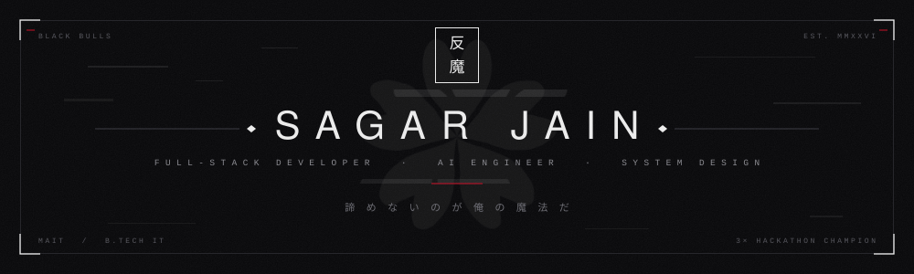
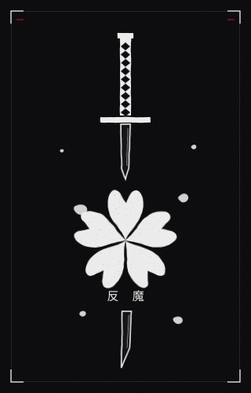

  

&nbsp;

&nbsp;

&nbsp;

## `01` &nbsp;PROFILE &nbsp;&nbsp;自己紹介

I build full-stack systems that make it to production — not demos that die in a repo.

Most of my work sits where **backend architecture meets applied AI**: retrieval pipelines that
actually retrieve, agent workflows that don't hallucinate their way through a task, and APIs
built to survive real traffic. Three hackathons, three wins, all of them shipped end-to-end
under deadline.

I'm a B.Tech IT student at **Maharaja Agrasen Institute of Technology**, currently deep in
system design at scale and MLOps. The rest is reps — 450+ problems solved, and a commit
almost every day.

 

| | |
|:--|:--|
| **Class** | Full-Stack Developer · MERN + AI |
| **Focus** | Backend systems · RAG & LLM integration · System design |
| **Squad** | BYTE Society — Technical Member |
| **Record** | 3× Hackathon Champion |
| **Method** | `Learn → Build → Ship → Improve` |
| **Status** | Open to collaborations & opportunities |

 

> **"I'll never give up — that's my magic."**
>
> No shortcuts, no talent I was born with. Just showing up and out-working the problem.

## `02` &nbsp;GRIMOIRE &nbsp;&nbsp;魔導書

## `03` &nbsp;ARSENAL &nbsp;&nbsp;武器庫

**LANGUAGES**

**FRONTEND**

**BACKEND &nbsp;·&nbsp; DATA**

**AI &nbsp;·&nbsp; ML**

**TOOLING**

## `04` &nbsp;WORKS &nbsp;&nbsp;作品

### 一 &nbsp;· &nbsp;[UnifiedOps Brain](https://github.com/sagarjain03/unifiedops-brain)

Enterprise AI operations platform. RAG-powered knowledge retrieval over internal documents,
autonomous agents for routine workflows, real-time analytics, and hardened auth — built for
industrial teams that can't afford a wrong answer.

`TypeScript` &nbsp;`Next.js` &nbsp;`Supabase` &nbsp;`Clerk` &nbsp;`RAG` &nbsp;`LLMs` &nbsp;`Tailwind`

### 二 &nbsp;· &nbsp;[AndThen](https://and-then-nine.vercel.app/)

Interactive storytelling engine where the narrative adapts to a HEXACO personality profile.
Branching multiplayer worlds, persistent state, and gamified progression.

`Next.js` &nbsp;`MongoDB` &nbsp;`JWT` &nbsp;`LLMs`

### 三 &nbsp;· &nbsp;[Research Scholar Monitoring System](https://research-scholar-system.vercel.app/)

Tracks PhD progress and predicts submission delays with an ML model whose reasoning is made
legible through SHAP — plus admin dashboards that turn the prediction into an action.

`Full-Stack` &nbsp;`Machine Learning` &nbsp;`SHAP`

## `05` &nbsp;RECORD &nbsp;&nbsp;戦績

| | Event | Result |
|:--|:--|:--|
| `2026` | **SmartOHack 3.0** | 1st Position |
| `2025` | **CodeVerse Hackathon** | 1st Position |
| `—` | **APOCALYPSE 3.0** | 2nd Runner-Up |
| `—` | **HackWithMAIT** | Top 10 — showcased at Microsoft Office |
| `ongoing` | **LeetCode** | 550+ problems solved |

### BYTE Society &nbsp;Technical Member

- Built a facial recognition attendance system with OpenCV — cut processing time by **70%**
- Designed interactive frontend experiences with **Three.js** and **GSAP**
- Contributing to the college **ERP system** on Next.js, Prisma and TypeScript

## `06` &nbsp;ACTIVITY &nbsp;&nbsp;活動

  

  

<picture>
  <source media="(prefers-color-scheme: dark)" srcset="https://raw.githubusercontent.com/sagarjain03/sagarjain03/output/github-contribution-grid-snake-dark.svg">
  <source media="(prefers-color-scheme: light)" srcset="https://raw.githubusercontent.com/sagarjain03/sagarjain03/output/github-contribution-grid-snake.svg">
  
</picture>

## `07` &nbsp;CONTACT &nbsp;&nbsp;連絡

Currently building the next real-world AI system, training on system design at scale, and
open to internships and collaborations. If you're working on something hard, I'd like to hear
about it.

| | |
|:--|:--|
| **Email** | [thesagarjain8@gmail.com](mailto:thesagarjain8@gmail.com) |
| **LinkedIn** | [sagar-jain-a68aa927b](https://www.linkedin.com/in/sagar-jain-a68aa927b/) |
| **Portfolio** | [my-portfolio-3hih.vercel.app](https://my-portfolio-3hih.vercel.app/) |

 

諦 め な い の が 俺 の 魔 法 だ

SAGAR JAIN &nbsp;·&nbsp; MMXXVI

